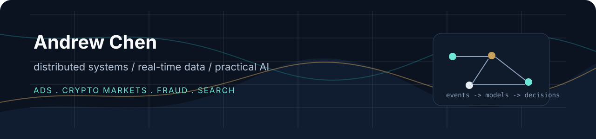
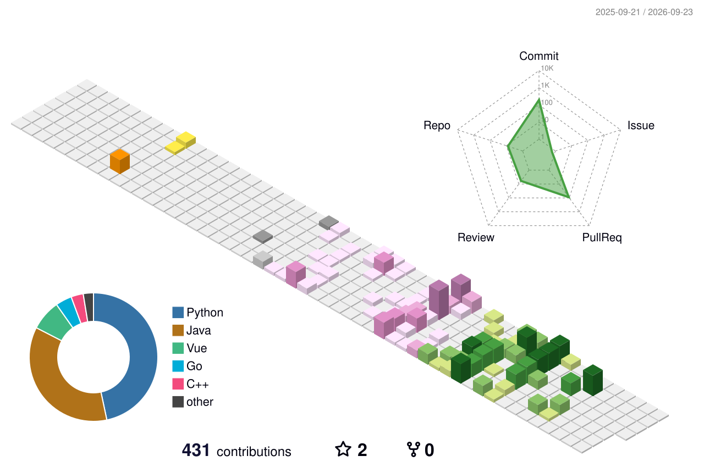

  

  <a href="https://medium.com/@andrewact">Writing</a> ·
  <a href="https://x.com/LeApe404">X / Twitter</a> ·
  <a href="mailto:andrew47ohio@gmail.com">Email</a>

## Hi, I'm Andrew.

I build real-time and distributed systems where latency, correctness, and product taste all matter.

My strongest interests are **fraud prevention**, **distributed systems**, **search**, **real-time systems**, and **practical AI**. I like backend-heavy projects that look like small production systems: ad-serving infrastructure, replayable crypto-market pipelines, event streams, freshness checks, ranking/search workflows, and useful interfaces on top of live data.

I write mostly **Java**, **Go**, **Python**, and **TypeScript**. Java is the language I have used the most day to day; my current public projects lean Go and Python because they fit the systems I am building right now. I am not trying to collect languages; I use them around one theme: turning messy real-world signals into systems people can trust.

## Start Here

| Project | What it shows | Stack |
| --- | --- | --- |
| [bidflock](https://github.com/AndrewAct/bidflock) | An ads infrastructure project: OpenRTB-shaped bid requests, service boundaries, Redis hot-path reads, Kafka/Redpanda events, ClickHouse analytics, and latency-oriented auction design. | Go, gRPC, Redis, Redpanda/Kafka, MongoDB, ClickHouse |
| [ticksense](https://github.com/AndrewAct/ticksense) | A replayable crypto-market lakehouse for market analytics, freshness monitoring, and reproducible data workflows. | Python, crypto market data, analytics |
| [portfolio-website](https://github.com/AndrewAct/portfolio-website) | My personal site and public surface for projects, writing, and experiments. | Python, web |

## What I Care About

- **Systems that can be explained.** I like codebases with clear boundaries, visible data flow, and failure modes you can reason about.
- **Live data with replay.** Dashboards are more useful when the underlying pipeline can be audited, rebuilt, and tested against history.
- **AI as leverage, not wallpaper.** I am interested in AI features that help people inspect, decide, and ship faster.
- **Small projects with real constraints.** Latency budgets, backpressure, freshness, observability, and correctness are more interesting to me than toy demos.

## Current Direction

I am building toward a profile centered on **real-time, data-intensive systems**:

- ads infrastructure and budget-safe bidding paths
- crypto-market data infrastructure
- fraud-prevention signals and decisioning
- search, ranking, and retrieval workflows
- event-driven analytics and lakehouse-style workflows
- practical AI interfaces for understanding fast-moving data

## Activity

  

## Writing

I use writing to clarify what I am learning and why I am building things. You can find longer notes on [Medium](https://medium.com/@andrewact).

If you are working on systems, data infrastructure, applied AI, or products that sit close to live data, I would be happy to talk.
